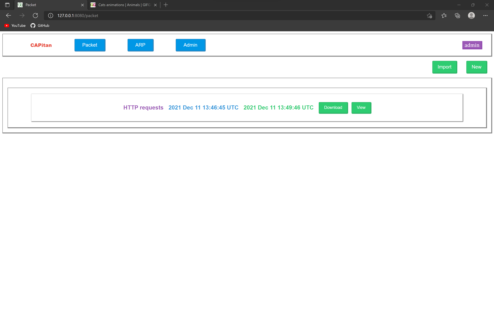
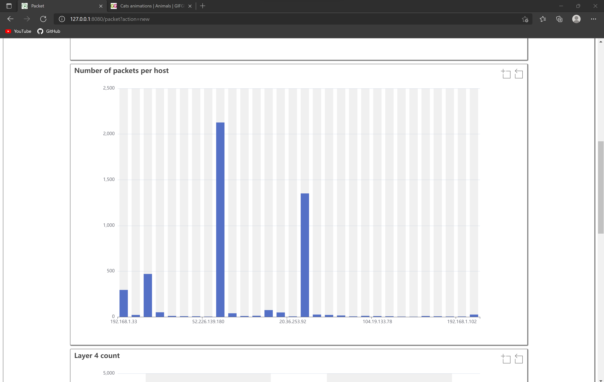

# CAPitan


**CAPitan** is a scriptable web UI based network sniffer, ARP scanner and spoofing build for being lightweight and easy
to config.

## Installation

First install `libpcap` if you are on Linux or `npcap` if your are on windows. Then...

```shell
go install github.com/shoriwe/CAPitan/cmd/capitan@latest
```

## Preview

To start **CAPitan** in memory mode at `127.0.0.1:8080` execute:

```shell
capitan memory
```

Then you can visit it from the url

```
http://127.0.0.1:8080
```

For more options check:

```shell
capitan memory -h
```

```shell
capitan help
```


The default credentials to login in the memory mode are:

Username: `admin`

Password: `admin`

### Network packet capture

#### Listing old captures

<div style="border: 1px solid black;">
    
</div>

#### Creating new captures

<div style="border: 1px solid black;">
    
</div>

#### Importing pcap files

<div style="border: 1px solid black;">
    
</div>

#### Looking at results

##### TCP streams

<div style="border: 1px solid black;">
    
</div>

##### Packets captured

<div style="border: 1px solid black;">
    
</div>

##### Topology

<div style="border: 1px solid black;">
    
</div>

##### Packets send per host count

<div style="border: 1px solid black;">
    
</div>

##### Layer 4 type count

<div style="border: 1px solid black;">
    
</div>

##### TCP stream content types

<div style="border: 1px solid black;">
    
</div>

### ARP Scanner

##### List old scans

<div style="border: 1px solid black;">
    
</div>

##### Start new scan

<div style="border: 1px solid black;">
    
</div>

### ARP Spoofing

<div style="border: 1px solid black;">
    
</div>

### Documentation

You can check the documentation of the scripting language [plasma](https://shoriwe.github.io/documentation/docs.html).

Then for the scripting functionality of the Network packet sniffer you can check [here](https://github.com/shoriwe/CAPitan/wiki/Sniffer-scripting).

For the scripting functionality of the ARP scanner check [here](https://github.com/shoriwe/CAPitan/wiki/ARP-scanner-scripting).

### Important note

The entire application is filled with XSS holes that I'm still patching, so you are advised.
